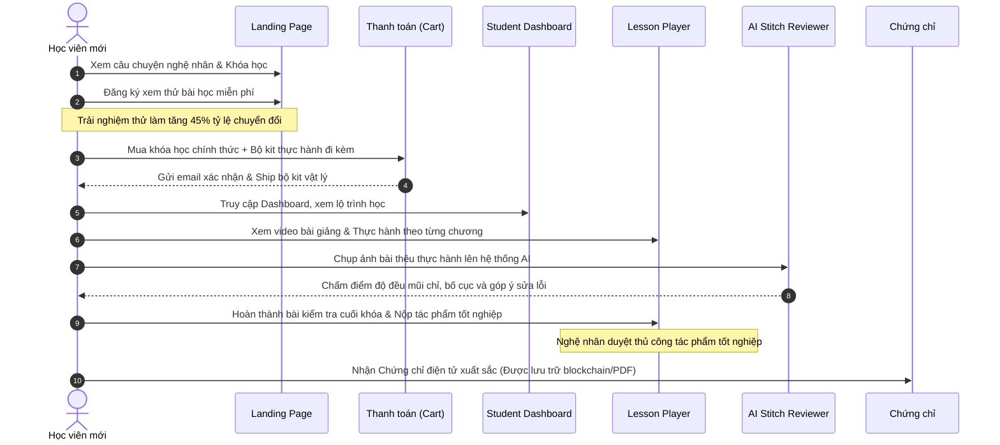
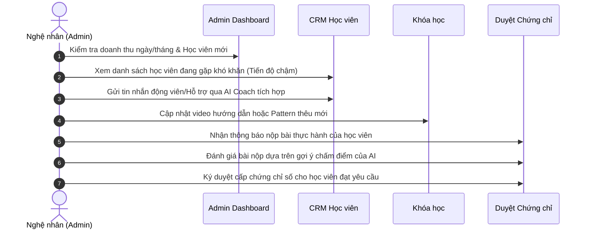

# Kiến trúc Thông tin & Luồng Người dùng (Information Architecture & User Flows)

Tài liệu này định hình cách thức tổ chức thông tin và điều hướng trong hệ thống Học viện Thêu tay Truyền thống Việt Nam.

---

## 1. Sơ đồ trang web (Sitemap)

Hệ thống được chia thành 4 khu vực lớn tương ứng với các quyền truy cập khác nhau:

```mermaid
graph TD
    A[Hệ thống Học viện Thêu tay] --> B[Khu vực Công cộng - Landing Page]
    A --> C[Khu vực Học viên - Student App]
    A --> D[Khu vực Quản trị - SaaS Admin]
    A --> E[Khu vực Cộng tác viên - Affiliate]

    B --> B1[Home - Câu chuyện & Khóa học nổi bật]
    B --> B2[Cửa hàng Handmade & Dụng cụ thêu]
    B --> B3[Thư viện Tài nguyên Công cộng]

    C --> C1[Dashboard học tập & Tiến trình]
    C --> C2[Lớp học trực quan - Course Player]
    C --> C3[Cộng đồng Học viên - Forum & Leaderboard]
    C --> C4[AI Stitch Evaluator - Tự chấm điểm bài thêu]
    C --> C5[Kho Chứng chỉ điện tử]

    D --> D1[SaaS Dashboard - Doanh thu & Thống kê]
    D --> D2[CRM Học viên - Quản lý tiến trình & Điểm số]
    D --> D3[Quản lý Khóa học & Bài giảng]
    D --> D4[Quản lý Đơn hàng & Sản phẩm vật lý]
    D --> D5[Duyệt bài thực hành & Cấp chứng chỉ]

    E --> E1[Báo cáo hoa hồng & Biểu đồ doanh thu]
    E --> E2[Trình tạo Link Affiliate & Tài nguyên quảng bá]
```

---

## 2. Luồng Người dùng Cốt lõi (User Flows)

### A. Luồng Đăng ký & Học tập (Học viên)
Luồng này tối ưu tỷ lệ chuyển đổi và trải nghiệm học lâu dài.

### B. Luồng Quản lý & Chăm sóc Học viên (Nghệ nhân / Admin)
Quy trình giúp nghệ nhân vận hành học viện một cách chuyên nghiệp như một nền tảng SaaS.

### C. Luồng Tiếp thị liên kết (Affiliate Partner)
Giúp học viên cũ hoặc cộng tác viên quảng bá học viện để nhận hoa hồng.

1.  **Đăng ký:** Học viên xuất sắc đăng ký làm Affiliate trên trang cá nhân.
2.  **Nhận link:** Hệ thống cấp Link Referral duy nhất và mã giảm giá 10% cho bạn bè học viên.
3.  **Chia sẻ:** Cộng tác viên đăng tác phẩm thêu của họ lên mạng xã hội kèm link giới thiệu.
4.  **Chuyển đổi:** Người mua click vào link, thực hiện mua khóa học.
5.  **Ghi nhận:** Hệ thống ghi nhận hoa hồng 25% trực tiếp vào ví của Cộng tác viên, hiển thị biểu đồ tăng trưởng doanh số theo thời gian thực.
